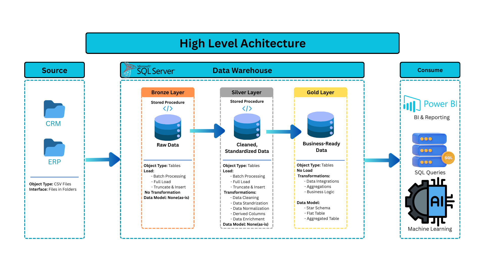
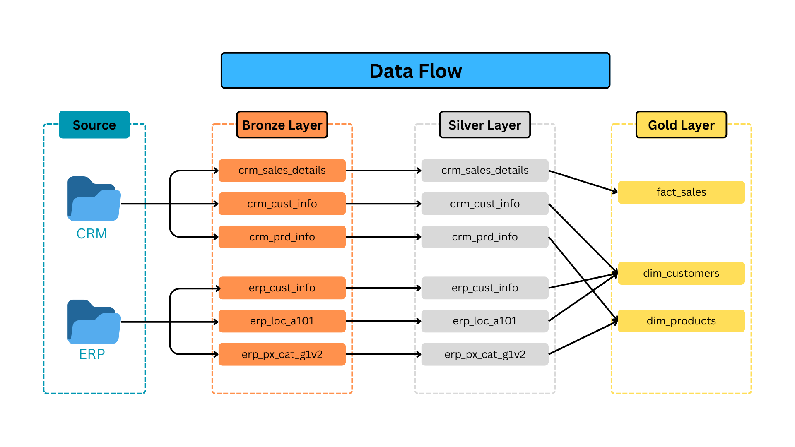

# 📦 SQL Data Warehouse Project  

## 📌 Project Overview  
This project is about building an **end-to-end SQL Data Warehouse** from scratch. The main idea was to design a system that can handle raw data from different sources, transform it step by step, and finally organize it into a clean structure that can support analytics and reporting.  

The project covers everything from **data ingestion** to **transformation** and **data modeling** using the **Bronze-Silver-Gold layer approach**.  

---

## 🏗️ Data Architecture  
The warehouse is divided into three main layers:  

- **Bronze Layer** → raw data from different sources.  
- **Silver Layer** → cleaned and standardized data.  
- **Gold Layer** → business-level tables (facts and dimensions).  

# 📦 SQL Data Warehouse Project  

## 📌 Project Overview  
This project is about building an **end-to-end SQL Data Warehouse** from scratch. The main idea was to design a system that can handle raw data from different sources, transform it step by step, and finally organize it into a clean structure that can support analytics and reporting.  

The project covers everything from **data ingestion** to **transformation** and **data modeling** using the **Bronze-Silver-Gold layer approach**.  

---

## 🏗️ Data Architecture  
The warehouse is divided into three main layers:  

- **Bronze Layer** → raw data from different sources.  
- **Silver Layer** → cleaned and standardized data.  
- **Gold Layer** → business-level tables (facts and dimensions).  

 

---

## 🔄 Data Flow  
The data flow shows how data travels from source systems into the warehouse. Each step applies validation and transformation rules to make the data ready for analysis.  

---

## 🔗 Data Integration  
Multiple data sources are integrated into the warehouse. The integration process makes sure that data is consistent and linked across systems (for example, customer and sales data coming from different platforms).  

---

## 🌟 Star Schema Design  
At the Gold layer, the data is modeled using a **Star Schema**. Fact tables hold transactional data, and dimension tables provide descriptive attributes. This design makes querying efficient and BI-friendly.  

  

---

## ⚙️ Implementation Steps  
1. Set up the database and schema structure.  
2. Loaded raw data into the Bronze layer.  
3. Applied transformations to build Silver layer tables.  
4. Designed fact and dimension tables for the Gold layer.  
5. Validated data using SQL queries to ensure accuracy.  

---

## 📊 Tech Stack  
- **SQL Server  for database  
- **SQL scripts & stored procedures** for ETL  
- **Canva** for visual diagrams  

---

## ✅ Key Learnings  
- Practiced applying **data warehouse design principles**.  
- Understood the importance of **naming conventions** and **layered architecture**.  
- Learned how to build a warehouse that is scalable and structured for business reporting.  

---

